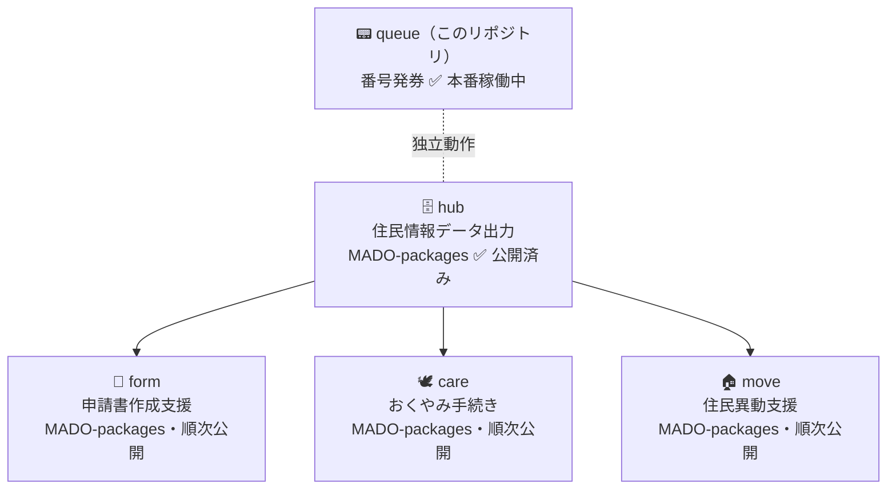

# MADO-queue — 番号発券

> An open-source queue-ticket system for small Japanese municipalities. Part of [MADO](https://github.com/Memuro-Town/MADO).


> 窓口に来た住民が、名前を55回書く。
> その問題を、現場の職員が自分で作って解決した。

北海道芽室町が開発・運用している行政窓口業務支援システム **MADO** のうち、**番号発券（`queue`）** の実装リポジトリ。
受付ネットワーク上で独立して動作し、庁内システムとのネットワーク接続は不要。住民の個人情報は扱わない。

> 📦 **このリポジトリは MADO の `queue`（番号発券）です。** 芽室町の窓口で**本番稼働中**。
>
> 🧭 **MADO は役割ごとにリポジトリが分かれている。**（📍現在地）
>
> | リポジトリ | 役割 |
> |---|---|
> | [MADO](https://github.com/Memuro-Town/MADO) | なぜ作ったか・設計方針・議論の場（コードはありません） |
> | 📍 **MADO-queue（このリポジトリ）** | 実装：番号発券（受付ネットワーク・個人情報を扱わない） |
> | [MADO-packages](https://github.com/Memuro-Town/MADO-packages) | 実装：hub / form / care / move（庁内ネットワーク・住民情報を扱う。現在は hub 公開済み） |
>
> プロジェクト全体の方針・比較表・導入一覧は [MADO](https://github.com/Memuro-Town/MADO) を参照。

---

## Getting Started

### Docker で起動（推奨）

```bash
git clone https://github.com/Memuro-Town/MADO-queue.git
cd MADO-queue
docker compose up --build
```

起動後、ブラウザで `http://localhost:8000` を開くと発券画面が立ち上がる。
初回起動時に自動でDBを初期化し、データは `data/numbers.db` に保存される。バックアップはこのファイルをコピーするだけ。

### ローカルで起動（Docker を使わない場合）

```bash
pip install -r requirements.txt
python init_db.py                                   # 初回のみ（DB初期化）
python app.py                                       # 開発サーバー
waitress-serve --host=0.0.0.0 --port=8000 app:app   # 本番起動（Waitress）
```

ビルド・テスト・DBリセット、および WSL（Windows）でのハマりどころは [docs/DEVELOPMENT.md](docs/DEVELOPMENT.md) を参照。

---

## ドキュメント

* [ドキュメント一覧（Index）](docs/README.md) — 各種ドキュメントへのポータル
* [業務要件定義書](docs/REQUIREMENTS.md) — 解決したい課題や業務仕様
* [システム設計書](docs/ARCHITECTURE.md) — 技術スタック、データベース、API
* [開発・環境構築ガイド](docs/DEVELOPMENT.md) — 環境構築、テスト、WSL固有の注意点
* [現場での使い方](docs/USE_CASES.md) — 窓口でどう使われ、なぜこの形なのか
* 導入自治体一覧 → [MADO/FORKED_SITES.md](https://github.com/Memuro-Town/MADO/blob/main/FORKED_SITES.md)（全パッケージ共通）

---

## 機能・画面構成

| URL | 説明 | 利用者 |
|-----|------|--------|
| `/` | 発券画面 | 来庁者（タブレット設置） |
| `/processing` | 処理画面 | 職員（呼び出し・対応操作） |
| `/display` | 案内表示 | ロビーモニター（大画面表示） |

導入はレシートプリンターと発券画面（`/`）のみの**スモールスタート**で始められる。

- **`/processing`** は後から追加した。待ち時間・処理時間のログ取得と、窓口を離れた職員が自席から混雑状況を把握できるようにするため。
- **`/display`** も後から追加した。音声呼び出しだけでは来庁者が気づかないケースがあるため、視覚でも呼び出し状況を確認できるように。

### カテゴリ番号帯

| カテゴリ | 番号帯 | 用途 |
|---------|--------|------|
| A | 001–499 | 一般窓口（初級） |
| B | 500–799 | 専門窓口（中級） |
| C | 800–   | その他（正職員） |
| D | —      | 印刷なし・来庁者カウント用 |

**初めて触る方:** このシステムが何のためにあるか・現場でどう使われるかは [docs/USE_CASES.md](docs/USE_CASES.md) から読むと分かりやすい。

カテゴリの設計意図・2枚印字の理由・窓口運用モデルの詳細は [docs/ARCHITECTURE.md](docs/ARCHITECTURE.md)・[docs/REQUIREMENTS.md](docs/REQUIREMENTS.md) を参照。

---

## パッケージ構成（全体像）



`queue` は受付ネットワーク上で独立して動作する。`hub` 以降は [MADO-packages](https://github.com/Memuro-Town/MADO-packages) にまとめており、現在は `hub` のみ公開。全体の地図は [MADO](https://github.com/Memuro-Town/MADO#パッケージ構成) が一次情報。

---

## 技術スタック

- **Framework**: Flask 3.x
- **Language**: Python 3.14
- **WSGI サーバー**: Waitress
- **Database**: SQLite（別途DBサーバー不要）
- **対応プリンター**: MUNBYN POS-80C（VID: `0x04b8` / PID: `0x0e20`・動作確認済み）
- **ブラウザ**: Chrome / Edge（最新版）

`hub` 以降の技術スタックは [MADO-packages](https://github.com/Memuro-Town/MADO-packages) を参照。

---

## Contributing

バグ報告・ドキュメント修正・設計議論、どこからでも歓迎する。各自治体の固有仕様はフォークで自由に派生してよい。

- **このリポジトリの Issue** — 番号発券（queue）固有の話
- **[MADO](https://github.com/Memuro-Town/MADO) の Issue** — 方針・パッケージ横断の議論
- **[MADO-packages](https://github.com/Memuro-Town/MADO-packages) の Issue** — hub など住民情報まわり

リポジトリ分割と進め方の案内: [Issue #27](https://github.com/Memuro-Town/MADO-queue/issues/27)

貢献ガイドは [CONTRIBUTING.md](CONTRIBUTING.md)、行動規範は [CODE_OF_CONDUCT.md](CODE_OF_CONDUCT.md)、脆弱性の報告は [SECURITY.md](SECURITY.md) を参照。

---

## 導入自治体

→ [MADO/FORKED_SITES.md](https://github.com/Memuro-Town/MADO/blob/main/FORKED_SITES.md)（全パッケージ共通。プロジェクト入口で一元管理）

ローカルに残している [docs/FORKED_SITES.md](docs/FORKED_SITES.md) は参照用の控え。更新の一次情報は MADO 側。

---

## License

MIT License — Copyright (c) Memuro Town

詳細は [LICENSE](LICENSE) を参照。

本リポジトリのコードは参考実装であり、各自治体での法令適合性・業務適合性は導入主体が確認すること。
